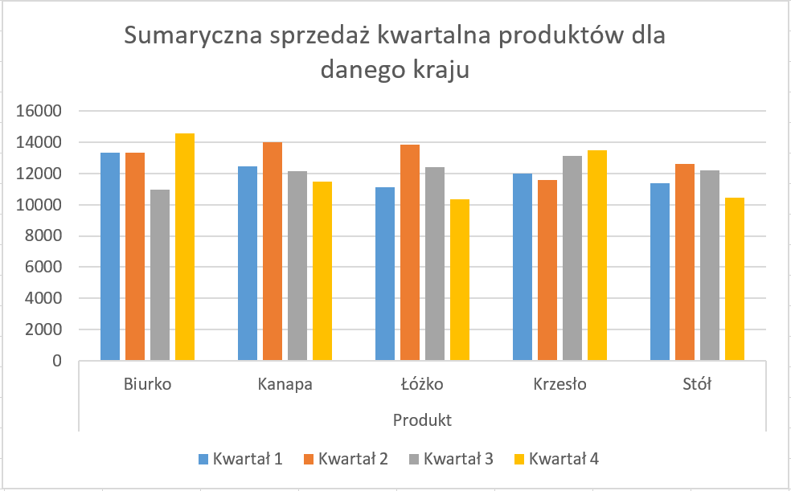
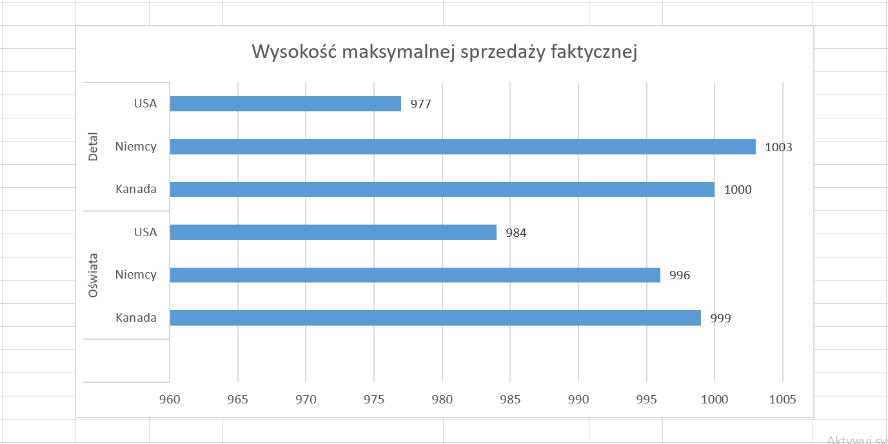

Projekt wykonany w ramach studiów w programie MS Excel 2016 wraz ze sprawozdaniem wykonanym w LaTeX.

W projekcie skupiono się na pełnej automatyzacji raportu, aby uniknąć ręcznego wpisywania danych:

1.  **Zaawansowane wyszukiwanie:** Wykorzystanie funkcji `INDEKS` oraz `PODAJ.POZYCJĘ` do precyzyjnego wyciągania danych o produktach z największą/najmniejszą sprzedażą.
2.  **Wykresy dynamiczne:** Automatyczna aktualizacja wizualizacji danych po zmianie parametrów wejściowych.
3.  **Dynamiczne nagłówki:** Zastosowano autorski mechanizm odmiany miesięcy przez przypadki (dopełniacz) przy użyciu tabeli pomocniczej i funkcji `WYSZUKAJ.PIONOWO`. Dzięki temu raport wyświetla np. "Wyniki dla miesiąca: **marca**" zamiast "marzec".
4.   **Sprawozdanie:** Sprawozdanie projektu wykonane w programie LaTeX -dokładnie opisuje przebieg projektu krok-po-kroku.

Poniżej kilka wykresów wizualizujących wyniki:

